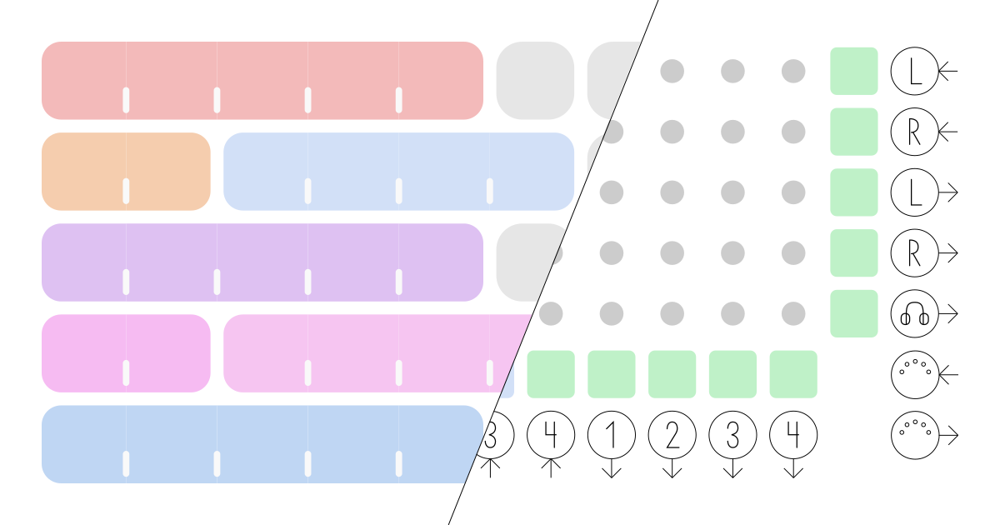

# ZOIA/Euroburo Patch Explorer

[](https://www.gnu.org/licenses/gpl-3.0)



## About

ZOIA and ZOIA Euroburo are modular digital effect pedals and Eurorack modules manufactured by Empress Effects. This
application, deployed at [darosh.github.io/zoian](https://darosh.github.io/zoian/) allows users to explore their .BIN
patch files. 

### Features

- Drop .BIN patch files or a folder containing them, .ZIP files work as well, you can also drop whole
  `~/Library/Application Support/.ZoiaLibraryApp` folder
- All processing happens in your browser &mdash; no data is sent to any server
- Contains old Euroburo factory demo [set](https://patchstorage.com/zoia-euroburo-factory-patches/) (you can drag & drop
  other sets your self, for
  example [this one](https://empresseffects.com/blogs/support-zoia/zoia-5-new-factory-patches))
- Highlights IO connections
- List starred parameters
- Switch between ZOIA and Euroburo layout
- CPU utilization overview
- Share patches via link
- Download shared user .BIN files
- Module options and parameters
- Controls
    - <kbd>Right-click</kbd> for context menu
    - <kbd>Left-click</kbd> show/hide tooltip
    - <kbd>Esc</kbd> Reset selection
    - <kbd>Shift</kbd> Hold to temporarily disable mouse over function
- Hotkeys / Context menu
    - <kbd>N</kbd> Previous patch
    - <kbd>M</kbd> Next patch
    - <kbd>S</kbd> Share patch
    - <kbd>D</kbd> Dark theme
    - <kbd>C</kbd> Show connection
    - <kbd>A</kbd> Animations
    - <kbd>E</kbd> Euroburo layout
    - Module description
    - <kbd>2...6</kbd> Max columns
- Happy little dots &amp; blocks made in Brno

### Explorer Quick Links

Access factory patch sets directly in the web explorer.

| Set                   | Link                                                                                                                                                                                                                                       |
|-----------------------|--------------------------------------------------------------------------------------------------------------------------------------------------------------------------------------------------------------------------------------------|
| Euroburo Factory Set  | [https://darosh.github.io/zoian/](https://darosh.github.io/zoian/)                                                                                                                                                                         |
| ZOIA Factory Set      | [https://darosh.github.io/zoian/#/?link=https://patchstorage.com/api/beta/patches/107803/files/107802/download/](https://darosh.github.io/zoian/#/?link=https://patchstorage.com/api/beta/patches/107803/files/107802/download/)           |
| Version 5 Factory Set | [https://darosh.github.io/zoian/#/?link=https://cdn.shopify.com/s/files/1/0028/5462/files/zoia_5_factory_patches.zip](https://darosh.github.io/zoian/#/?link=https://cdn.shopify.com/s/files/1/0028/5462/files/zoia_5_factory_patches.zip) |

### Disclaimer

Blocks and their connections may be displayed incorrectly (incorrect blocks and/or their incorrect order,
see [./lib/README.md](./lib/README.md) for more information)

The displayed parameter value and the dot on the slider represent the base setting of the parameter, independent of any CV modulation. When CV connections are active, the actual value on the device may differ from this base value as it's being dynamically modified by the incoming CV signal, such parameters are marked with approximately equal sign `≈`. The visual slider's dot position should match the circle position on your ZOIA device, both showing the base value before CV modulation is applied.

So far only tested with Chrome browser.

Feel free to report any issue.

## Development

### Prerequisites

- [Deno](https://deno.com/) (v2.1.4 or higher)

### Scripts

#### Install dependencies

```bash
deno task deno:install
```

#### Dev server

```bash
deno task dev
```

#### Build

```bash
deno task build
```

#### Publishing the build to GitHub pages

Rename the build [./dist](./dist) folder to [./docs](./docs) and push to repo.

### Tips

- both /lib and /src app are using [debug](https://www.npmjs.com/package/debug) package, the log can be turned on with
  ```localStorage.debug='*'```
- disable app context menu (to restore native one) with ```localStorage.menu = false```
- color mixing:
    - [localhost:3000/#/test-colors](http://localhost:3000/#/test-colors)
    - or [darosh.github.io/zoian/#/test-colors](https://darosh.github.io/zoian/#/test-colors)
- display test of module name abbreviations:
    - [localhost:3000/#/test-display](http://localhost:3000/#/test-display)
    - or [darosh.github.io/zoian/#/test-display](https://darosh.github.io/zoian/#/test-display)
- display module and block data:
    - [localhost:3000/#/test-modules](http://localhost:3000/#/test-modules)
    - or [darosh.github.io/zoian/#/test-modules](https://darosh.github.io/zoian/#/test-modules)

## Integration

The app supports two methods for integrating specific patch views:

### 1. Remote File Link

Access patches via direct URL:

```
https://darosh.github.io/zoian/#/?link=<encoded-file-url>
```

[EXAMPLE REMOTE FILE LINK](https://darosh.github.io/zoian/#/?link=https%3A%2F%2Fpatchstorage.com%2Fapi%2Fbeta%2Fpatches%2F181743%2Ffiles%2F181739%2Fdownload%2F)

Requirements:

- Host server must support CORS
- Provider's permission for content usage
- Remote file must be a .BIN file or .ZIP file containing them

### 2. Embedded Content

Embed patch data directly in URL using base64-encoded gzipped content:

```
https://darosh.github.io/zoian/#/?file=<base64-gzipped-content>
```

[EXAMPLE EMBEDDED PATCH LINK](https://darosh.github.io/zoian/#/?file=H4sIAAAAAAAAE72ZSW4UQRBFs7syo20mm3kGM3qeZ4znAXuJQGKNMAsLYSNkcwLOwYIDcABWLLgCC47CDpUcaX99h9pWhaCllru%2B4sWvn9Xuzor%2B0wjhxYe3b3Y%2F7r0P%2BtgIIbSFEJ6Hw0ehf2vh%2BIfF1hxs3cEWDjY62ORgxcE2KrJl1hYH2%2BpgTznY0w72jIM962DPOdi2imz5P9TuYM872AsO9qKDveRgLzvYKw72qoO95mCvO9gbDvamg73lYG872DsO9q6D7XCw9xzsfQf7wME%2BdLCPHOxjB9t5QrYdXtf0sz33OBBDCN8Gbf6cfn%2Fl0qTf3yfxHQGuoVrdqF0wgrTr%2BzDz%2BXMn8%2FEocoTPj3qT3OsbNo%2B56xVz1525687cRZPcHe9sHnMXFXMXztyFM3dskvv7Z5vH3LFi7ujMHZ25U5PcL7%2FYPOZOFXMnZ%2B7kzC1Ncvf8sHnMLRVzizO3OHM3muT%2B%2BdvmMXejYu6GM3ejQm4875aK593iPO%2BWiued27bCfOO4Rxt4tMJnUu6V%2F776dZT9GkLoUq%2FunKNzXyv79IHWrXU9htarPqXWo%2BfTC3W9sF9ErdA1Yo3rIryfUWM2Gixef9S4XzL6JaOfwPqhxh5ieIjhIeTRp2vQT1qZbQi0fq0bMLRBuB4DuvaDUDcIe3DUCr3vYo3rot5%2Fs8ZsNNik71PWuF8y%2BiWjH86mUGMPMTzE8BDyGNI1GCatzDYG2rDWjRjaKFyPEV37Uagbhfsa1Aq9l2WN66LONFhjNhps0nkXa9wvGf2S0U%2Fg8wg19hDDQwwPIY8xXYNx0spsU6CNa92EoU3C9ZjQ852Eukm4V0St0PkAa1wXdU7EGrPRYJPOEFnjfsnol4x%2BAt8lqLGHGB5ieAh5TGn%2FadLKbE9Bm9a6J4Y2A9fjia79DNTNwP03aoXOXFjjuqizN9aYjQabYD%2BBGvdLRr9k9MM9KGrsIYaHGB5CHk91DWZJKz0XQJvVujlDm4frMadrPw918zDTQK3QORZrXBd1nskas9Fgk866WeN%2ByeiXjH55T88ae4jhIYaHkMeCrsEiaWW2FdAWtW7J0Jbheizp2i9D3TLMiVArdDbIGtdFnRGzxmw02KR7V9a4XzL6JaOfwB4LNfYQw0MMDyGPFV2DVUNbg3Ve1TVdg7o1mKmhVugclTWuizpPZ43ZaLBJ9%2Fqscb9k9EtGv3xPyhp7iOEhhoeQxzN93WVo66TVjLqa1uXrUe4f9n8X%2FnTwu%2FDS6%2B3Njrwxy8cjdDxKx2N0PE7HE3Q8ScdTh8eLe5tbOx1b2%2F07e7tZK455xmOe9X%2F8zPeHjf90jK9z%2Fr87XyXz5B8AAA)

Implementation notes:

- Non-gzipped content works but produces very long URLs
- Strip trailing zero bytes
- Browser implementation example:

```javascript
const uint8Array = uint8Array.subarray(0, patch.size * 4).slice()
const gz = await gzipUint8Array(uint8Array)
const file = removePadding(uint8ArrayToBase64(gz)) // Requires encodeURIComponent() for URL usage
```

## Licence

Released under [GPL v3 license](LICENSE), see also notes about derived work in [./lib/README.md](./lib/README.md).

## Credits

- [darosh](https://github.com/darosh) - Application design and development
- [sbw25phi2](https://patchstorage.com/author/sbw25phi2/) - Data mining specialist
- [claude.ai](https://claude.ai/) - Assistance with Python to TypeScript parser conversion
